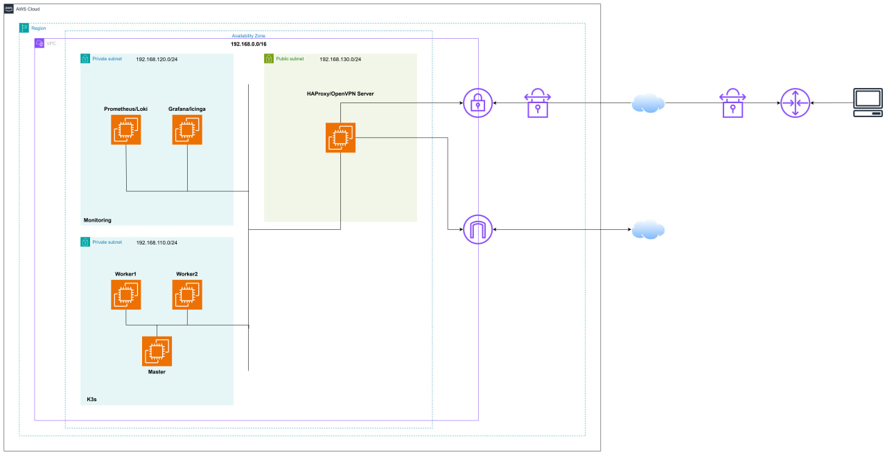
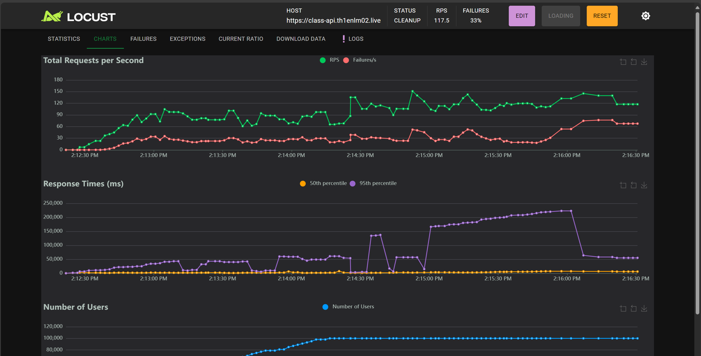

# Monitoring Cloud Infrastructure using Prometheus & Loki with Grafana & Icinga

## 1. Overview
This project focuses on developing a comprehensive monitoring solution for microservices applications deployed on **K3s**. By leveraging **Prometheus, Loki, Grafana, and Icinga**, we aim to collect metrics, manage logs, and generate alerts efficiently.

## 1.1 Scope of Research 📌
The research scope includes:
- 📊 Evaluating monitoring requirements for microservices systems, including metric collection, log management, and alerting.
- 🛠 Deploying and configuring **Prometheus and Grafana** for metric collection and visualization, **Loki** for log management, and **Icinga** for system and service monitoring.
- ⚡ Conducting performance tests to assess the efficiency of the monitoring setup, comparing alert accuracy and data processing capabilities of each tool.
- 🔍 Analyzing the strengths and weaknesses of each tool in cloud infrastructure and microservices monitoring.
- 🚀 Proposing optimizations based on analysis and experimental results.

## 1.2 Project Summary 📜
This project aims to develop an effective cloud infrastructure monitoring solution using industry-standard tools. The combination of **Prometheus, Loki, Grafana, and Icinga** provides a **comprehensive** and **comparative** approach to monitoring. The study not only enhances observability and incident response but also provides insights into how each toolset performs. This enables users to select the **optimal** monitoring solution for their system based on real-world comparisons.

## 2. Cloud Infrastructure on AWS ☁️

    
    </img>

### IP Address Allocation Table 📍

| VPC | Subnet | Host | Server(s) |
|------|--------|------|-----------|
| 192.168.0.0/16 | 192.168.110.0/24 | 192.168.110.10 | K3s Master 🖥️|
| | | 192.168.110.11 | K3s Worker 1 🖥️|
| | | 192.168.110.12 | K3s Worker 2 🖥️|
| | 192.168.120.0/24 | 192.168.120.20 | Icinga/Grafana 📊|
| | | 192.168.120.21 | Prometheus/Loki 📡|
| | 192.168.130.0/24 | 192.168.130.30 | Haproxy ⚖️|

The cloud infrastructure is deployed on AWS, consisting of multiple EC2 instances within a **single VPC** and **three subnets**:
- 🏗 **Private subnet for K3s cluster**: Hosts the **K3s master** and **worker nodes** for microservices deployment.
- 📊 **Private subnet for monitoring**: Hosts **Prometheus, Loki, Grafana, and Icinga** for system observability.
- 🌍 **Public subnet**:
    - ⚖️ **HAProxy**: Load balances traffic across K3s nodes and routes requests to appropriate backends.
    - 🔒 **OpenVPN**: Allows secure access to the cloud infrastructure from local environments.

## 3. Automated Deployment & Management 🤖
To streamline deployment and configuration, the following automation tools are used:
- **Terraform** 🌍: Automates infrastructure provisioning.
  - Repository: [terraform-hub](https://github.com/NT531-P11-Monitoring-Tools/terraform-hub)

    </img>

- **Ansible** 🔧: Manages server configurations.
  - Repository: [ansible-hub](https://github.com/NT531-P11-Monitoring-Tools/ansible-hub)

    </img>

- **Kubernetes Manifests** 📦: Defines deployment configurations for K3s components.
  - Repository: [kubernetes-manifests](https://github.com/NT531-P11-Monitoring-Tools/kubernetes-manifests)

    </img>

## 4. Load Testing for Monitoring Evaluation 📈
To simulate realistic traffic and assess system performance, [**Locust**](https://locust.io/) is used to generate API requests:
- **Traffic Simulation with Locust**: [traffic-simulation](https://github.com/NT531-P11-Monitoring-Tools/traffic-simulation)

    </img>

    </img>

## 5. Microservices Application Source Code 🏗️
The microservices application is available here:
[simple-microservices-application](https://github.com/NT531-P11-Monitoring-Tools/simple-microservices-application)

## 6. Performance Testing Scenarios 🎯
A detailed evaluation of the monitoring system was conducted using the following test scenarios. The full demonstration can be found in the video:
- 🎥 **Video Demo**: [YouTube Link](https://www.youtube.com/watch?v=bETCRAICRug&t=311s&ab_channel=L%C6%B0uMinhThi%E1%BB%87n)

### Test Scenarios:
1. 🚀 **Evaluating the Performance of the Load Balancing System**
2. 📉 **Assessing Resource Usage in the K3s Cluster**
3. 🚨 **Evaluating the Alerting System**
   - **Testing Alerts for Resource Overload**
        - 🔥 API Calls to Services in the K3s Cluster
        - ⚡ Generating Load on Servers
   - **Testing Alerts for Service or Server Unavailability**
        - 🛑 Stopping Services in K3s
        - 🔌 Shutting Down Servers

## 7. Project Documentation 📂
All related documents and slides can be found in the following repository:
- 📄 **Report document**: [Here](../materials/NT531.P11_NHOM01.pdf)

## 8. References 📚
- 📜 [Prometheus Official Documentation](https://prometheus.io/docs/)
- 📜 [Loki Official Documentation](https://grafana.com/oss/loki/)
- 📜 [Grafana Official Documentation](https://grafana.com/docs/)
- 📜 [Icinga Official Documentation](https://icinga.com/docs/)
- 📜 [K3s Official Documentation](https://k3s.io/)
- 📜 [Terraform Official Documentation](https://developer.hashicorp.com/terraform/docs)
- 📜 [Ansible Official Documentation](https://docs.ansible.com/ansible/latest/index.html)

## 9. Conclusion 🏁
This project provides a **scalable, automated, and efficient** monitoring solution for microservices on **K3s**. By leveraging a combination of **Prometheus, Loki, Grafana, and Icinga**, we establish a **robust** observability stack while enabling **comparative analysis** of these monitoring tools. The use of **Terraform, Ansible, and Kubernetes Manifests** ensures an automated and reproducible deployment process. 🚀

